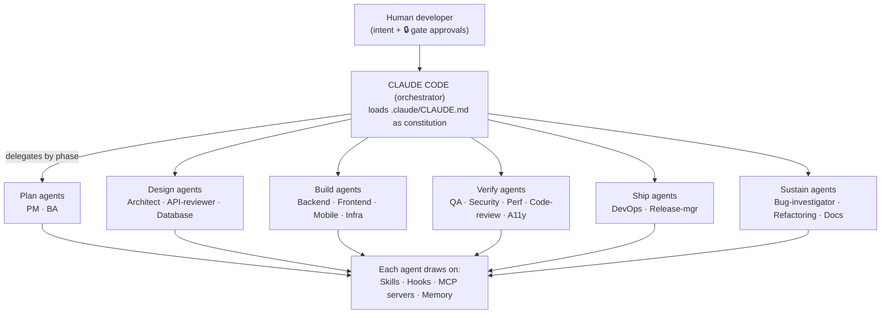
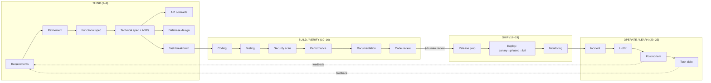
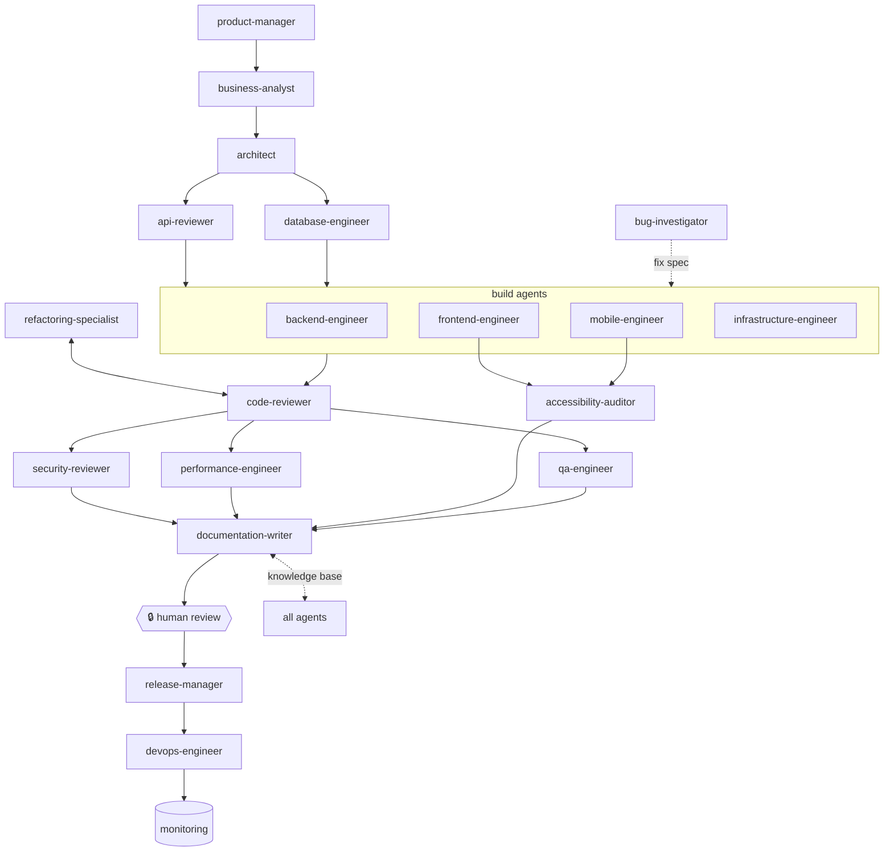

# HOW TO USE — Claude Code Enterprise SDLC Pipeline

> A complete, practical user guide for the `claude-pipeline` repository.
> Written for a developer who has **never used this pipeline before**. Read it top to
> bottom the first time; use the [Reference](#15-reference) tables afterward.
>
> Source of truth: this guide documents the repository as it actually exists (inspected
> file-by-file). Where behavior is **inferred** rather than stated in a file, it is
> marked *(inferred)*. When this guide and `.claude/CLAUDE.md` disagree, **CLAUDE.md wins.**

---

## Table of contents

1. [Introduction](#1-introduction)
2. [Installation](#2-installation)
3. [Repository structure](#3-repository-structure)
4. [Pipeline lifecycle](#4-pipeline-lifecycle)
5. [Every supported command](#5-every-supported-command)
6. [Every skill](#6-every-skill)
7. [Every agent](#7-every-agent)
8. [Hooks](#8-hooks)
9. [Orchestration scripts](#9-orchestration-scripts)
10. [JSON / config schemas](#10-json--config-schemas)
11. [Typical workflows](#11-typical-workflows)
12. [Adapting the pipeline to a new project](#12-adapting-the-pipeline-to-a-new-project)
13. [Best practices](#13-best-practices)
14. [Troubleshooting](#14-troubleshooting)
15. [Reference](#15-reference)

---

## 1. Introduction

### What this pipeline is

`claude-pipeline` is a **drop-in Claude Code environment** that turns Claude Code from "a
faster autocomplete" into the **governed orchestration layer for your entire software
development lifecycle (SDLC)** — from a raw idea, through design, implementation, review,
security, testing, release, and operations, all the way to postmortems that feed back into
the backlog.

It is delivered as a set of files you copy into a project's `.claude/` directory (plus a few
top-level folders). Once installed, opening `claude` in that project gives you:

- **19 specialized subagents** (product-manager → release-manager), each least-privilege.
- **23 skills** — reusable "how to do X well" playbooks that auto-load when a task matches.
- **Lifecycle hooks** — deterministic shell scripts that enforce guardrails (no secrets,
  tests pass, formatting applied, schema/API/vuln checks) on *every* run, regardless of
  what the model "decides."
- **A tiered MCP server registry** — typed, least-privilege access to git, issue trackers,
  databases, monitoring, browsers, and cloud.
- **A "constitution"** (`.claude/CLAUDE.md`) that carries your project's facts and rules and
  is loaded into every session.
- **Prompt templates, document templates, playbooks, workflows, CI/CD templates**, and a
  15-part design guide in `docs/`.

It is **stack-agnostic by construction**: nothing hardcodes a language, framework, cloud, or
database. Toolchain behavior is detected at runtime or read from `.claude/CLAUDE.md`.

### Problems it solves

`docs/14-common-mistakes.md` enumerates 20 failure modes teams hit when adopting Claude Code
at scale. The pipeline's core answer is a **meta-pattern**: *don't rely on the model to
remember or choose to do the right thing — make the right thing structural.* Concretely:

| Problem | How the pipeline prevents it |
|---------|------------------------------|
| Secrets leak into commits/context | 4-layer defense: `.gitignore` + `deny` permissions + `pre-edit-guard` + `secret-scan` (session, pre-commit, CI); enforced via managed settings |
| Unreviewed AI code merged fast | Mandatory `code-reviewer` auto-review **before** any human looks + a 🔒 human review gate |
| "It's done" but it doesn't compile | `on-stop-verify` re-prompts on red; Definition of Done requires *observed* test results |
| Context pollution → degraded output | Artifact hand-offs, delegated search, progressive disclosure, summarization |
| One mega-agent doing everything | 19 role-scoped agents with least-privilege tools |
| Prompt injection via issues/PRs/web | External content is treated as untrusted **data**, never instructions; effects are gated |
| Hardcoded to one stack | `CLAUDE.md` facts + toolchain auto-detection |
| Fixing symptoms, not root cause | The bugfix flow demands a repro + a failing test + a 5-whys root cause |
| No memory — repeated mistakes | `knowledge/` long-term memory; `session-start` re-injects recent decisions |
| Skipping security under deadline | Security gate is mandatory and non-skippable for auth/money/PII — even in a hotfix |

### Overall architecture — the five pillars

From `docs/00-overview.md` and `docs/01-architecture.md`:

| Pillar | Claude Code primitive | What it gives you | Where |
|--------|----------------------|-------------------|-------|
| **Specialized roles** | Subagents | 19 role-scoped agents, each least-privilege | `.claude/agents/` |
| **Repeatable expertise** | Skills | 23 skills auto-invoked by task match | `.claude/skills/` |
| **Enforced guardrails** | Hooks | Deterministic gates that don't rely on the model | `.claude/hooks/` |
| **Governed reach** | MCP servers | Typed, least-privilege access to external systems | `.claude/mcp/` |
| **Durable memory** | CLAUDE.md + knowledge base | Context that persists and doesn't pollute | `.claude/CLAUDE.md`, `knowledge/` |



### High-level workflow

```
Idea → Requirements → Architecture → Task breakdown → Implementation → Auto-review
     → Unit/Integration tests → Security review → Performance review → Documentation
     → 🔒 Human review → Merge → Deployment → Monitoring → Production feedback
```

The value proposition is **"speed between gates, judgment at gates."** Everything between the
five 🔒 human gates is machine-executed and machine-verified; humans spend attention only at
the gates (requirements, architecture, security, review, deploy).

### Who should use it

- **Engineers** adopting Claude Code who want consistency and safety, not just autocomplete.
- **Platform / DevEx teams** standardizing AI-assisted delivery across many repos.
- **Regulated orgs** (finance, health, gov) that need enforced security gates and audit trails.
- Teams of any size — the [adoption ladder](#12-adapting-the-pipeline-to-a-new-project) lets
  you take one rung at a time (just the constitution, just the security hooks, or the whole
  thing).

---

## 2. Installation

### Prerequisites

| Requirement | Why | Notes |
|-------------|-----|-------|
| **Claude Code CLI** | The whole pipeline is a Claude Code environment (agents, skills, hooks, settings, MCP all live under `.claude/`). | Use a version that supports subagents, skills, MCP, and the hook events `SessionStart` / `PreToolUse` / `PostToolUse` / `Stop` (all used in `settings.json`). |
| **Bash + coreutils** | All hooks are `bash` scripts. | Linux/macOS; on Windows use WSL. |
| **`git`** | Version control, `session-start` git status, several hooks and MCP servers. | A git repo is expected. |
| **`python3`** | `session-start.sh` uses it to JSON-encode injected context (degrades gracefully if absent). | Optional but recommended. |
| **`jq`** *(recommended)* | `lib.sh` uses `jq` to parse hook stdin JSON; falls back to a crude grep/sed parser if absent (only reliable for flat string fields). | Strongly recommended for correct hook behavior. |
| **`gitleaks`** *(recommended)* | `secret-scan.sh` and `pre-commit.sh` prefer `gitleaks`; otherwise fall back to regex patterns. | Improves secret detection. |
| **Formatters** (prettier / gofmt / ruff / rustfmt) *(optional)* | `post-edit-format.sh` auto-formats edited files if the tool is present. | Only for the languages you use. |
| **Vuln scanners** (osv-scanner / trivy / npm audit; semgrep) *(optional)* | `vuln-scan.sh` runs SCA + SAST in CI. | Needed for the security gate in CI. |

### GitHub / GitLab requirements

- The CI/CD templates target **GitHub Actions** (`automation/github/`) and **GitLab CI**
  (`automation/gitlab/`). Adopt whichever matches your host.
- Human 🔒 gates in CI rely on **GitHub Environments** (manual approval) or GitLab
  `when: manual` jobs. The approver's identity is passed to `pre-deploy.sh` via the
  `DEPLOY_APPROVED_BY` variable.
- The `github` MCP server needs `GITHUB_PERSONAL_ACCESS_TOKEN` (referenced as `${GITHUB_TOKEN}`).

### Project requirements

- An existing (or new) git repository.
- You should be able to state your **build / test / lint / typecheck / format** commands —
  these go into `.claude/CLAUDE.md` PROJECT FACTS (and/or the `CLAUDE_*_CMD` env vars).

### Install — copy the pipeline in

**Quick start** (from the README):

```bash
# 1. Copy the pipeline into your project (or start fresh in this repo)
cp -r claude-pipeline/.claude   your-project/.claude
cp -r claude-pipeline/prompts   your-project/prompts
cp -r claude-pipeline/templates your-project/templates
cp -r claude-pipeline/playbooks your-project/playbooks
# ...and any other directories you want (workflows/, automation/, knowledge/, architecture/).

# 2. Fill in your project's facts
$EDITOR your-project/.claude/CLAUDE.md      # stack, commands, conventions, boundaries

# 3. Enable the MCP servers you need
$EDITOR your-project/.claude/mcp/mcp.json   # remove servers you don't use

# 4. Make hooks executable
chmod +x your-project/.claude/hooks/*.sh

# 5. Open Claude Code in the project and go
claude
```

**Preferred for teams:** vendor the pipeline via the sync script so upgrades are deliberate
(see [§9](#9-orchestration-scripts)):

```bash
# From your project root:
bash automation/scripts/sync-pipeline.sh  <template-repo-url-or-path>  [git-ref]
```

The sync script updates the *shared* components and **preserves** your project-local files
(`.claude/CLAUDE.md`, `.claude/settings.local.json`, `.claude/mcp/mcp.json`).

### Initial setup

1. **Fill in `.claude/CLAUDE.md`** — the `PROJECT FACTS` YAML block (name, domain, languages,
   frameworks, package managers, `commands`, `conventions`, `boundaries`). Everything
   downstream reads this.
2. **Set command env vars** — either in `.claude/CLAUDE.md` or by copying
   `settings.local.json.example` → `settings.local.json` and setting `CLAUDE_TEST_CMD`,
   `CLAUDE_LINT_CMD`, `CLAUDE_FORMAT_CMD`, `CLAUDE_TYPECHECK_CMD`. Hooks auto-detect common
   toolchains, but explicit vars win.
3. **Choose MCP servers** — keep the `essential` tier, enable `recommended` ones you have,
   leave `optional` (cloud/infra) off until needed. Provide credentials via environment
   variables **only**.
4. **Verify** the install:
   ```bash
   python3 -m json.tool .claude/settings.json  > /dev/null && echo "settings OK"
   python3 -m json.tool .claude/mcp/mcp.json    > /dev/null && echo "mcp OK"
   for h in .claude/hooks/*.sh; do bash -n "$h" && echo "ok: $h"; done
   ```
5. **Smoke test** inside Claude Code:
   ```
   claude
   > /agents            # confirm your 19 agents load
   > Use the code-reviewer agent to review the current diff
   ```

---

## 3. Repository structure

The layout separates **standing behavior** (agents/skills/hooks — *how the org works*),
**task assets** (prompts/templates — *how a piece of work is shaped*), **operational
knowledge** (playbooks/knowledge/architecture), and **delivery** (automation). This is what
makes the pipeline reusable: you vendor the shared parts and keep only `CLAUDE.md`
project-specific.

```
claude-pipeline/
├── README.md                 # what this is; mandatory vs optional; quick start
├── ADOPTION.md               # phased rollout (single project → org-wide)
├── HOW_TO_USE.md             # ← this guide
├── .gitignore                # ignores local state + secrets
│
├── .claude/                  # ── everything Claude Code loads ──
│   ├── CLAUDE.md             # THE CONSTITUTION: facts, conventions, roster, memory, guardrails
│   ├── settings.json         # hook wiring, permission allow/ask/deny, env, model routing (shared, committed)
│   ├── settings.local.json.example  # per-dev overrides (copy → settings.local.json, gitignored)
│   ├── agents/               # 19 subagent definitions
│   ├── skills/               # 23 skills; each <skill>/SKILL.md (+ references/)
│   ├── hooks/                # lifecycle enforcement scripts + hooks.md catalog + lib.sh
│   └── mcp/                  # mcp.json (tiered registry) + README.md (security model)
│
├── prompts/                  # 11 reusable, parameterized prompt templates + README (versioned)
├── templates/                # 10 document templates: prd, functional/technical spec, adr, ...
├── playbooks/                # human runbooks: feature, bug-fix, hotfix, release, incident, tech-debt, migration
├── workflows/                # machine orchestration: feature-flow (+ .workflow.js), bugfix-flow
├── automation/               # CI/CD that calls the SAME hooks: github/, gitlab/, pre-commit, scripts/
│
├── architecture/             # host-project architecture: system-overview + adr/ (living docs)
├── knowledge/                # long-term memory: decisions.md, glossary.md, patterns.md
│
├── docs/                     # THE 15-part architecture guide
└── examples/banking/         # end-to-end worked example (instant P2P transfer)
```

### Folder-by-folder

| Folder | Purpose | When used | Who invokes it | Claude or user? |
|--------|---------|-----------|----------------|-----------------|
| `.claude/CLAUDE.md` | The constitution — project facts, conventions, agent roster, memory contract, guardrails | **Every** session (auto-loaded) | Claude Code runtime | Both — user edits it; Claude reads it |
| `.claude/settings.json` | Hook wiring, permission allow/ask/deny, env vars, model routing | Every session | Claude Code runtime | User configures; runtime enforces |
| `.claude/settings.local.json` *(gitignored)* | Per-developer overrides (personal grants, local command overrides, local MCP) | Every session, if present | Claude Code runtime | Individual dev |
| `.claude/agents/` | 19 standing role definitions (who does what, with which tools/model) | On delegation ("Use the X agent…") or by workflows | Claude / user | Claude runs them; user names them |
| `.claude/skills/` | 23 reusable *how-to* expertise packs | Auto-invoked when a task matches the skill's `description` | Claude (auto) | Claude; user can force via `/skill-name` |
| `.claude/hooks/` | Deterministic enforcement scripts (secrets, tests, format, schema/API/vuln) + `lib.sh` + `hooks.md` | On hook events (session/edit/bash/stop) and in CI | Claude Code runtime, git, CI | Neither authors at runtime; both benefit |
| `.claude/mcp/` | Tiered MCP server registry (`mcp.json`) + security model (`README.md`) | When agents need external systems (git, tracker, DB, monitoring, browser, cloud) | Agents via MCP | User enables; Claude uses |
| `prompts/` | 11 parameterized, versioned prompt templates | When you want a standardized task request | User (fill placeholders) → agent | User composes; Claude executes |
| `templates/` | 10 document skeletons (PRD, specs, ADR, contracts, threat model, test plan, release notes, postmortem) | When an agent produces a lifecycle artifact | Agents write instances | Claude fills; user reviews |
| `playbooks/` | Step-by-step **human** runbooks | When a human is driving a lifecycle scenario | Humans | User-facing |
| `workflows/` | **Machine** orchestration specs (declarative `.md` + one executable `.workflow.js`) | Multi-agent fan-out, deterministic runs, CI | Main Claude session or the Workflow runner | Claude / automation |
| `automation/` | CI/CD templates that call the same hooks + `sync-pipeline.sh` | Delivery pipeline (CI, deploy, pre-commit) | CI runners, git | Platform/SRE |
| `architecture/` | The **host project's** current design + ADRs | As the system evolves | `architect`, `documentation-writer` | Both |
| `knowledge/` | Long-term memory (`decisions.md`, `glossary.md`, `patterns.md`) | Durable, cross-session facts | `documentation-writer`, any agent making a non-obvious decision; `session-start` tails `decisions.md` | Both |
| `docs/` | The 15-part design/reference guide | Reading/onboarding | Humans | Reference (read, don't run) |
| `examples/banking/` | End-to-end worked example (P2P transfer): every artifact filled in | Learning by example | Humans | Reference |

**Committed vs local vs generated:**

- **Committed (shared):** `.claude/{CLAUDE.md,settings.json,agents,skills,hooks,mcp}`,
  `prompts/`, `templates/`, `playbooks/`, `workflows/`, `automation/`, `architecture/`,
  `knowledge/`, `docs/`.
- **Local (gitignored):** `.claude/settings.local.json`, `.claude/logs/`, `.claude/.cache/`.
- **Never committed:** secrets, `.env*`, keys — enforced by `.gitignore` + `secret-scan` +
  `pre-edit-guard`.

---

## 4. Pipeline lifecycle

The full lifecycle is **23 stages** (from `docs/03-sdlc-flow.md`), grouped into four arcs:

- **Think** (stages 1–9) — cheap to change: requirements, spec, architecture, contracts,
  data model, planning, task breakdown.
- **Build / Verify** (10–16) — coding, testing, security, performance, docs, review, bugfix.
- **Ship** (17–19) — release prep, deployment, monitoring.
- **Operate / Learn** (20–23) — incidents, hotfix, retrospective, tech-debt.

Feedback from operate/learn flows back into requirements and `knowledge/`. **The loop is the
point.**



### The five 🔒 human gates

Everything between gates is automatable; the gates are where human judgment is irreplaceable.

1. **Requirements** — PM confirms you're building the right thing.
2. **Architecture** — a lead accepts the design and its irreversible choices.
3. **Security** — `security-reviewer` + human clear auth/money/PII surfaces
   (**mandatory, non-skippable**).
4. **Review** — a human makes the final call on the change.
5. **Deploy** — an approver authorizes production promotion.

### Stage → owner → skills → hooks (condensed)

| # | Stage | Owning agent | Key skills | Hooks that fire | 🔒 Gate |
|---|-------|--------------|------------|-----------------|---------|
| 1 | Requirement gathering | product-manager | — | session-start | 🔒 requirements |
| 2 | Requirement refinement | business-analyst | documentation | — | — |
| 3 | Functional spec | business-analyst | documentation | — | — |
| 4 | Technical spec | architect | architecture, adr-authoring | api/schema-change-guard | 🔒 architecture |
| 5 | Architecture design | architect | architecture | — | 🔒 architecture |
| 6 | API contracts | api-reviewer | api-design | api-change-guard | — |
| 7 | Database design | database-engineer | database, migration | schema-change-guard | — |
| 8 | Sprint planning | product-manager | — | — | — |
| 9 | Task breakdown | architect + product-manager | architecture | — | — |
| 10 | Coding | backend/frontend/mobile/infra-engineer | backend, frontend, api-design | pre-edit-guard, secret-scan, post-edit-format, on-stop-verify | — |
| 11 | Testing | qa-engineer | testing | on-test-fail | — |
| 12 | Security scanning | security-reviewer | security | secret-scan, vuln-scan | 🔒 security |
| 13 | Performance optimization | performance-engineer | performance, observability | — | — |
| 14 | Documentation | documentation-writer | documentation, adr-authoring | — | — |
| 15 | Code review | code-reviewer | code-review, security, testing | — | 🔒 review |
| 16 | Bug fixing | bug-investigator | debugging, testing | on-test-fail | — |
| 17 | Release preparation | release-manager | git | pre-commit | — |
| 18 | Deployment | devops-engineer + release-manager | docker, kubernetes, git | pre-deploy, post-deploy | 🔒 deploy |
| 19 | Monitoring | devops-engineer | observability | post-deploy | — |
| 20 | Incident handling | bug-investigator (IC) | debugging, observability | — | 🔒 emergency |
| 21 | Hotfix workflow | bug-investigator + release-manager | debugging, git | secret-scan, vuln-scan, pre-deploy | 🔒 emergency deploy |
| 22 | Retrospective | documentation-writer | documentation | — | — |
| 23 | Technical debt mgmt | refactoring-specialist | refactoring | on-stop-verify | — |

*(Full I/O and success criteria per stage are in `docs/03-sdlc-flow.md` Table B.)*

---

## 5. Every supported command

> **Important, and easy to get wrong:** This pipeline **does not ship custom project slash
> commands.** There is **no `.claude/commands/` directory** in the repository *(verified by
> inspection)*. The pipeline is driven three ways instead — and knowing which is which is the
> single most common point of confusion for new users.

### 5.1 Natural-language agent delegation (the primary "command" surface)

The canonical way to invoke pipeline work is a plain-English instruction naming a canonical
agent. `.claude/CLAUDE.md` specifies the exact form:

- **Syntax:** `Use the <agent-name> agent to <task>.`
- **Parameters:** the agent name (must be one of the 19 canonical names — see [§7](#7-every-agent))
  and a task description; optionally point it at inputs (a ticket, a spec link, a diff).
- **Example:**
  ```
  Use the code-reviewer agent to review the current diff.
  Use the architect agent to design the technical approach for the P2P transfer feature,
    per templates/functional-spec.md.
  Use the bug-investigator agent to reproduce and root-cause issue #482.
  ```
- **Expected output:** the agent's role-specific artifact (a PRD, a spec, a diff, ranked
  review findings, a threat model, etc.), following that agent's output contract.
- **When to use:** any time you want a specific SDLC role's expertise.
- **Common mistakes:** using a name that isn't a canonical agent (Claude may fall back to a
  generic agent); asking an agent to do work outside its role (e.g. asking `documentation-writer`,
  which has only `Read`/`Write`, to run shell commands).

### 5.2 Skills — auto-invoked, or forced with `/`

Skills load **automatically** when your task matches a skill's `description`. Several skills
are **also user-invocable as slash commands** (they appear in Claude Code's skill list).
Typing `/<skill-name>` forces the skill. Full catalog in [§6](#6-every-skill). Examples that
behave command-like:

| Slash form | What it does |
|------------|--------------|
| `/prd-writer` | Draft/structure a Product Requirements Document |
| `/adr-authoring` | Author an Architecture Decision Record |
| `/api-design` | Design/review an API contract |
| `/commit-message` | Generate a commit message from the diff |
| `/security-review` | Security review of pending changes on the branch |
| `/review` | Review a GitHub pull request |
| `/code-review` *(if enabled)* | Review your working diff |
| `/run` | Launch/drive the project's app to verify a change |
| `/init` | Initialize/refresh a `CLAUDE.md` |

*(inferred: the exact set of user-invocable skills depends on your Claude Code installation
and which skills are registered; the project's own 23 skills under `.claude/skills/` are
primarily **auto-invoked**, not typed.)*

### 5.3 The workflow runner (multi-agent orchestration)

The one executable orchestrator, `workflows/feature-flow.workflow.js`, is run as a Claude Code
**Workflow script** (see [§9](#9-orchestration-scripts)). It is not a slash command; it is
launched by the workflow runner / in CI, with `args` supplying the spec link and task list.

### 5.4 Built-in Claude Code commands you'll use

These are Claude Code built-ins (not defined by this repo) that the pipeline relies on:

- `/agents` — confirm the 19 agents load.
- `/config`, `/permissions` — inspect/adjust settings.
- `!<command>` prompt prefix — run a shell command in-session (handy for interactive logins
  like `gcloud auth login` or `gh auth login`).

> **Bottom line:** if you're looking for `/feature`, `/bugfix`, `/deploy` slash commands,
> they don't exist here. Use agent delegation (5.1), the auto-invoked skills (5.2), and the
> workflow runner (5.3). If you want project slash commands, you can add a `.claude/commands/`
> directory yourself — it's a supported Claude Code feature, just not shipped by this pipeline.

---

## 6. Every skill

Skills encode *how* to do a class of work well. Unlike agents (*who*), skills are
**auto-invoked** when a task matches the skill's `description`. Each skill is a
`<name>/SKILL.md` with the structure **Purpose · When invoked · Inputs · Outputs · Procedure ·
Best practices · Anti-patterns**, plus optional `references/` files (deep checklists) loaded
only when the procedure calls for them (**progressive disclosure** — keeps context lean).

**Composability:** one agent may pull several skills (e.g. `backend-engineer` uses `backend`
+ `api-design` + `testing` + `database`).

### 6.1 Catalog (all 23)

| Skill | Objective / trigger | Reference files | Primary users |
|-------|---------------------|-----------------|---------------|
| **architecture** | System design — patterns (layered/hexagonal/event-driven/micro), boundaries, C4, NFRs, trade-offs | `references/patterns-cheatsheet.md` | architect |
| **backend** | Server-side impl — service structure, error handling, idempotency, transactions, resilience (timeouts/retries/backoff/circuit breakers) | — | backend-engineer |
| **frontend** | UI impl — component structure, state, data fetching/caching, forms/validation, client perf (bundle, render, Core Web Vitals) | — | frontend/mobile-engineer |
| **api-design** | REST/GraphQL/gRPC contracts — resource modeling, naming, versioning, status codes, pagination, idempotency, error formats, backward-compat | `references/rest-checklist.md` | api-reviewer, backend-engineer |
| **testing** | Test strategy across unit/integration/contract/E2E/non-functional; deterministic, behavior coverage, test pyramid | — | qa-engineer, all |
| **database** | Data modeling, normalization vs denorm, indexing, query optimization (kill N+1), safe zero-downtime migrations (expand/contract), transactions/isolation | — | database-engineer |
| **docker** | Minimal/secure/reproducible images, multi-stage, layer cache, non-root, healthchecks, image scanning, Compose for local dev | — | devops, infrastructure |
| **aws** | Cloud infra — compute/storage/network choices, IAM least-privilege, cost, read-only introspection (Azure/GCP analogous) | — | infrastructure, devops |
| **terraform** | HCL — module structure, remote state/locking, plan-before-apply, drift, workspaces, secrets out of state (apply is human-gated) | — | infrastructure |
| **kubernetes** | Manifests/Helm — Deployments, Services, Ingress, requests/limits, probes, HPA, rollout/rollback, security contexts, Secrets | — | devops, infrastructure |
| **git** | Branching model, Conventional Commits, small PRs, rebase vs merge, bisect, safe revert, protected-branch hygiene | — | all engineers, release-manager |
| **code-review** | Review a diff — severity ranking, correctness/security/perf/maintainability lenses, require a concrete failure scenario per finding, reuse over duplication, approve/request-changes | `references/review-checklist.md` | code-reviewer |
| **debugging** | Systematic — reproduce → isolate → hypothesize → root-cause from logs/traces; find true cause, not symptom | — | bug-investigator |
| **logging** | Structured/JSON logs, levels, correlation/trace IDs, never log secrets/PII, sampling | — | backend, devops |
| **observability** | Three pillars (logs/metrics/traces), SLI/SLO/error budgets, RED/USE, dashboards, symptom-based alerts | `references/slo-guide.md` | devops, performance, bug-investigator |
| **security** | Threat modeling (STRIDE), secure-coding review, vuln triage; exploit-scenario findings | `references/secure-coding-checklist.md`, `references/prompt-injection.md` | security-reviewer, all |
| **performance** | Measure-first, perf budgets, profiling, common bottlenecks (N+1/allocation/IO), load testing, caching | — | performance-engineer |
| **documentation** | Right doc type per audience, docs-as-code, anti-drift, diagrams | — | documentation-writer |
| **refactoring** | Behavior-preserving improvement under test cover; never mix restructuring with behavior change | — | refactoring-specialist |
| **migration** | Schema/data migrations (backfill, dual-write, expand-contract), framework/version upgrades, zero-downtime cutovers with rollback | — | database, backend |
| **dependency-update** | Vet a new/updated dependency — license, maintenance health, transitive risk, SCA/vuln scans, changelog review, staged rollout | `references/dependency-vetting-checklist.md` | all, security-reviewer |
| **prompt-engineering** | Author/edit/review this pipeline's agents/skills/prompts — role clarity, context minimalism, output contracts, versioning/changelog | — | anyone editing the pipeline |
| **adr-authoring** | Write ADRs — context/decision/options/consequences, plus the ADR index and status lifecycle | *(uses `templates/adr.md`)* | architect, documentation-writer |

### 6.2 How to use skills — dependencies & best practices

- **Trigger:** you don't call most skills — Claude reads the `description` and auto-invokes on
  match. To force one, type `/<skill-name>` (for the user-invocable ones).
- **Workflow:** `SKILL.md` loads first (scannable procedure); the heavy `references/` file
  loads only when the procedure needs it.
- **Dependencies:** stack-specific skills (`docker`, `terraform`, `kubernetes`, `aws`) assume
  those tools; the rest are stack-agnostic and detect the toolchain from the project.
- **Best practices** (from `docs/05-skills.md`):
  - Descriptions should be **trigger-precise** ("Use when …"), not vague topics.
  - Procedure over prose; push depth to `references/`.
  - Include **anti-patterns** — what *not* to do is as valuable as what to do.
  - Version changes via the `prompt-engineering` skill.

### 6.3 Example

> You ask: *"Add an idempotent POST /transfers endpoint."* Claude matches and loads
> **api-design** (contract shape, idempotency), **backend** (transactions, resilience), and
> **testing** (behavior coverage) automatically — no explicit invocation needed. If the change
> touches a table, **database** and **migration** load too.

---

## 7. Every agent

19 role-scoped subagents live in `.claude/agents/<name>.md`. Each carries frontmatter
(`name`, `description`, `tools`, `model`) and a body with **Mission · Responsibilities ·
Inputs · Outputs · Required context · Skills used · MCP usage · Hooks triggered ·
Collaboration · Operating prompt · Success criteria**.

**Universal rules:**

- **No agent merges or self-approves.** Every agent *proposes*; humans approve the 🔒 gates.
- **Model tiers:** `opus` for judgment-heavy roles (planning, design, review, security,
  performance, investigation); `sonnet` for execution roles (build, ops, docs, refactor).
- **Tools = least privilege:** reviewers/auditors/analysts have no `Edit`; build/ops agents
  have `Read/Edit/Write/Bash`; `documentation-writer` is uniquely minimal (`Read`, `Write`).

### 7.1 Plan phase

**`product-manager`** — *opus · Read, Grep, Glob, Write, WebSearch, WebFetch*
- **Responsibility:** turn ambiguous intent into a crisp, prioritized, testable PRD.
- **Inputs:** raw problem statement, tickets/roadmap (issue-tracker), prior PRDs (knowledge-base), `templates/prd.md`.
- **Outputs:** completed PRD; prioritized user stories with Given/When/Then acceptance criteria; non-goals; open-questions register.
- **When called:** the very start of an initiative, before any design.
- **Collaborates:** → `business-analyst`, `architect`; ↔ pairs with `business-analyst`.
- **Approve/merge:** propose only; 🔒 routes to human product owner on pricing/regulatory/metric changes.

**`business-analyst`** — *opus · Read, Grep, Glob, Write, WebSearch, WebFetch*
- **Responsibility:** refine an approved PRD into a rigorous functional spec.
- **Inputs:** approved PRD + acceptance criteria; open-questions; domain glossaries; `templates/functional-spec.md`.
- **Outputs:** functional spec, data dictionary, edge-case catalogue, hardened traceable acceptance criteria.
- **When called:** after PRD is agreed, before technical design.
- **Collaborates:** ← `product-manager`; → `architect`, `api-reviewer`, `qa-engineer`.
- **Approve/merge:** propose only; never invents a business rule to fill a gap.

### 7.2 Design phase

**`architect`** — *opus · Read, Grep, Glob, Write, WebSearch, WebFetch*
- **Responsibility:** translate the functional spec into a technical design; choose patterns/boundaries; write ADRs; set NFR targets.
- **Inputs:** functional spec/PRD, CLAUDE.md facts, existing `architecture/` diagrams + ADRs, constraints.
- **Outputs:** `templates/technical-spec.md`, ADRs in `architecture/adr/`, updated C4 diagrams, prioritized risk list.
- **When called:** before implementation on anything non-trivial; whenever a change alters structure.
- **Collaborates:** ← PM/BA; → `api-reviewer`, `database-engineer`, build agents; ↔ `security-reviewer`, `performance-engineer`.
- **Approve/merge:** propose only; does not write production code; 🔒 architecture gate.

**`api-reviewer`** — *opus · Read, Grep, Glob, Bash, WebSearch, WebFetch (no write)*
- **Responsibility:** design/review API contracts (REST/GraphQL/gRPC) for consistency and backward-compat.
- **Inputs:** functional + technical spec, proposed/existing contract + OpenAPI/proto, prior versions.
- **Outputs:** API design review (blocking + non-blocking), backward-compat verdict, finalized `templates/api-contract.md`, deprecation path.
- **When called:** before an interface is published and on any contract change; **adjudicates the `api-change-guard` hook.**
- **Collaborates:** ← BA, `architect`; → `backend-engineer`, `frontend/mobile-engineer`.
- **Approve/merge:** propose only; 🔒 routes any breaking change to a human API owner.

**`database-engineer`** — *opus · Read, Grep, Glob, Bash, WebSearch, WebFetch (no write)*
- **Responsibility:** data modeling, schema design, migrations, indexing, query performance — correctness, reversibility, safe rollout.
- **Inputs:** functional spec + data dictionary, technical spec + contracts, existing schema/migration history/workloads, `templates/database-design.md`.
- **Outputs:** `templates/database-design.md`, reversible migrations (up/down), index/query tuning (with execution plans), backfill runbook.
- **When called:** any change touching the data layer; **validates the `schema-change-guard` hook.**
- **Collaborates:** ← `architect`, BA; → `backend-engineer`, `qa-engineer`; ↔ `performance-engineer`.
- **Approve/merge:** read-only analysis unrestricted; 🔒 human DBA sign-off before destructive/locking/retention-affecting migrations.

### 7.3 Build phase

**`backend-engineer`** — *sonnet · Read, Edit, Write, Grep, Glob, Bash*
- **Responsibility:** implement server-side logic/services/APIs against an approved TSD + contract, with tests.
- **Inputs:** TSD, API contract, functional spec, database design, existing service code.
- **Outputs:** implemented + tested code (reviewable diff), unit + integration tests, structured logs/metrics, contract/schema-change notes.
- **When called:** once design and contracts are settled.
- **Collaborates:** ← `architect`, `api-reviewer`, `database-engineer`; → `code-reviewer`, `qa-engineer`.
- **Approve/merge:** propose only; "the contract is law"; 🔒 routes new deps / weakened auth to a human; never commits failing tests or secrets.

**`frontend-engineer`** — *sonnet · Read, Edit, Write, Grep, Glob, Bash*
- **Responsibility:** implement accessible, tested, browser-verified UI against a design + contract.
- **Inputs:** functional spec + design refs, API contract, existing component library/tokens.
- **Outputs:** tested UI code (diff), component/integration tests + browser-verified flows, all states (loading/empty/error/offline), a11y-conscious markup.
- **When called:** once interface design and contract are settled.
- **Collaborates:** ← BA, `api-reviewer`, designers; → `code-reviewer`, `qa-engineer`, `accessibility-auditor`.
- **Approve/merge:** propose only; 🔒 routes client-side payments/credentials/PII flows to a human.

**`mobile-engineer`** — *sonnet · Read, Edit, Write, Grep, Glob, Bash*
- **Responsibility:** implement native/cross-platform mobile features; handle offline, device constraints, store-release.
- **Inputs:** functional spec + mobile design, API contract, existing mobile codebase/platform config/store requirements.
- **Outputs:** tested mobile code (diff), offline/sync + resilient networking, unit/UI tests + device-matrix notes, store-release readiness notes.
- **When called:** once design and contract are settled.
- **Collaborates:** ← BA, `api-reviewer`, designers; → `code-reviewer`, `qa-engineer`, `release-manager`.
- **Approve/merge:** propose only; 🔒 routes store submission / new sensitive permissions / on-device payments to a human.

**`infrastructure-engineer`** — *sonnet · Read, Edit, Write, Grep, Glob, Bash*
- **Responsibility:** author secure, cost-aware IaC (cloud, networking, Kubernetes).
- **Inputs:** technical spec + ADRs, existing IaC/state/inventory, NFRs (availability/capacity/compliance/cost).
- **Outputs:** reviewable IaC with a `plan` diff + cost/impact summary, least-privilege network/IAM, reproducible env-separated config with rollback, drift/DR notes.
- **When called:** provisioning or changing infrastructure.
- **Collaborates:** ← `architect`, `release-manager`; → `devops-engineer`, `backend-engineer`; ↔ `security-reviewer`.
- **Approve/merge:** read/`plan` unrestricted; 🔒 **`apply` is ALWAYS gated** to a human operator.

### 7.4 Verify phase

**`qa-engineer`** — *opus · Read, Edit, Write, Grep, Glob, Bash*
- **Responsibility:** own product quality end-to-end — risk-based test strategy, tests at all levels, E2E verification, quality-gate enforcement.
- **Inputs:** functional spec + acceptance criteria, API contract (for contract tests), the build/diff, `templates/test-plan.md`.
- **Outputs:** `templates/test-plan.md` with traceability, generated tests, E2E results with evidence, **go/no-go verdict**.
- **When called:** plan testing from spec, build coverage before release, gate a build.
- **Collaborates:** ← BA, build agents; → `bug-investigator`, `release-manager`; ↔ `code-reviewer`.
- **Approve/merge:** issues go/no-go but does not merge; 🔒 routes gate failures under pressure to a human.

**`code-reviewer`** — *opus · Read, Grep, Glob, Bash (no write)*
- **Responsibility:** review a diff for correctness, security, and reuse/simplification; rank findings.
- **Inputs:** the diff, the ticket/spec, CLAUDE.md conventions, surrounding code.
- **Outputs:** structured findings (`file:line` · severity · concrete failure scenario · suggested fix), a verdict (approve / request-changes), top-3 for humans; optional inline PR comments via `github` MCP.
- **When called:** immediately after code is written, before opening/merging a PR (runs after `secret-scan`/`post-edit-format`).
- **Collaborates:** ← any build agent; → routes security findings to `security-reviewer`, perf to `performance-engineer`, bugs to `bug-investigator`; hands verdict to the 🔒 review gate.
- **Approve/merge:** **explicitly does NOT merge or self-approve** — verdict is advisory.

**`security-reviewer`** — *opus · Read, Grep, Glob, Bash (no write)*
- **Responsibility:** own the 🔒 **mandatory** security gate — threat-model, review, triage to pass/fail with remediation.
- **Inputs:** diff + spec/contract, existing `templates/threat-model.md`, vuln/secret-scan outputs, data-classification notes.
- **Outputs:** `templates/threat-model.md`, gate verdict (pass / conditional-pass / fail) with prioritized findings, triaged vuln report, waiver records (owner + expiry).
- **When called:** any change touching auth/authz/session/secrets/crypto/money/PII-PHI; threat modeling; triage; **mandatory pre-merge/deploy gate.** Fires on `secret-scan`, `vuln-scan`, `pre-commit`, `pre-deploy`.
- **Collaborates:** ← `architect`, build agents, `api-reviewer`; → `release-manager`, owning build agent; ↔ `qa-engineer`, `infrastructure-engineer`.
- **Approve/merge:** owns the security verdict; **fails closed** on anything it cannot verify; 🔒 routes waivers to a human.

**`performance-engineer`** — *opus · Read, Grep, Glob, Bash (no write)*
- **Responsibility:** define/defend perf budgets; measure, profile, optimize under realistic load.
- **Inputs:** TSD + database design, prod/staging metrics + traces, query plans, existing budgets/baselines.
- **Outputs:** budgets + SLO alignment, profiling reports with evidence, load/stress/soak plans + results, optimization specs with before/after (percentiles), capacity forecast.
- **When called:** set/verify budgets, profile slow paths, optimize queries, load-test, plan capacity, diagnose regressions.
- **Collaborates:** ← `architect`, `qa-engineer`; → `backend-engineer`, `database-engineer`, `release-manager`; ↔ `database-engineer`, `architect`.
- **Approve/merge:** go/no-go verdict; refuses to sign off on unmeasured claims.

**`accessibility-auditor`** — *sonnet · Read, Grep, Glob, Bash (no write)*
- **Responsibility:** ensure UI meets WCAG 2.2 AA — automated axe scan + manual semantics/keyboard/screen-reader checks.
- **Inputs:** rendered UI + component diff, functional spec, design tokens/contrast, prior audits.
- **Outputs:** WCAG 2.2 AA conformance report (per-criterion pass/fail + severity), triaged axe results, prioritized remediation, gate verdict.
- **When called:** to gate accessibility-sensitive frontend/mobile work. Fires on `on-stop-verify`, `pre-commit`, `pre-deploy`.
- **Collaborates:** ← `frontend/mobile-engineer`, PM; → `frontend/mobile-engineer`, `release-manager`; ↔ `frontend-engineer`, `qa-engineer`.
- **Approve/merge:** verdict only; must not pass a surface with unaddressed level-A failures.

### 7.5 Ship phase

**`devops-engineer`** — *sonnet · Read, Edit, Write, Bash*
- **Responsibility:** build/operate reliable CI/CD + deployment automation with safe rollout/rollback and observability.
- **Inputs:** TSD + deploy-affecting ADRs, existing pipeline/container/orchestration config, release plan + gate verdicts, SLOs.
- **Outputs:** CI/CD pipelines + manifests, rollout/rollback automation, observability config, post-deploy verification.
- **When called:** build/change CI/CD, automate deploys, configure rollout/rollback, wire observability. Fires on `pre-deploy`, `post-deploy`, `pre-bash-guard`, `secret-scan`.
- **Collaborates:** ← `release-manager`, `infrastructure-engineer`; → `release-manager`, on-call; ↔ `infrastructure-engineer`, `performance-engineer`.
- **Approve/merge:** executes deploys but 🔒 routes production deploys/provisioning to a human — "automate the safe path; make the unsafe path hard."

**`release-manager`** — *sonnet · Read, Edit, Write, Bash*
- **Responsibility:** coordinate merged code → tagged deployable release; verify all gates; decide versioning; own the 🔒 deploy go/no-go.
- **Inputs:** merged history + issues, gate verdicts from security/QA/perf/a11y, prior release notes/versioning, deploy readiness.
- **Outputs:** versioned tag/cut, `templates/release-notes.md` + changelog, go/no-go decision record with evidence, deploy hand-off package.
- **When called:** prepare a release, compile notes, decide versioning, cut/tag, coordinate deploy gate. Fires on `pre-deploy`, `pre-commit`, `on-stop-verify`.
- **Collaborates:** ← security/QA/perf/a11y reviewers, PM; → `devops-engineer`; ↔ `devops-engineer`, PM.
- **Approve/merge:** cuts/tags and can initiate rollback, but the deploy decision is **always** a human 🔒 gate; does not audit code itself.

### 7.6 Sustain phase

**`bug-investigator`** — *opus · Read, Edit, Write, Grep, Glob, Bash*
- **Responsibility:** turn a vague report into a reliable repro, a proven root cause, and a failing test — then hand a **fix spec** to the owning build agent. Diagnoses; does not implement the production fix.
- **Inputs:** bug report + issue, logs/traces/metrics, git history (bisect), functional spec.
- **Outputs:** reproduction (steps + env), failing test committed as a guard, evidence-backed RCA (cause vs symptom), fix specification.
- **When called:** reproduce/root-cause a defect; incident IC. Fires on `on-test-fail`, `pre-commit`, `on-stop-verify`.
- **Collaborates:** ← QA/PM, monitoring/on-call; → the owning build agent; ↔ build agent, `performance-engineer`.
- **Approve/merge:** does not implement fixes or merge; "hand a spec, not a patch"; 🔒 routes production mitigation decisions to a human.

**`refactoring-specialist`** — *sonnet · Read, Edit, Write, Bash*
- **Responsibility:** improve internal structure without changing behavior — under existing test cover.
- **Inputs:** target module + its tests, tech-debt/review findings, intended structure (TSD), coverage reports.
- **Outputs:** refactored code (tests green), added characterization tests, transformation summary, flags for any behavior discrepancy.
- **When called:** pay down debt, reduce duplication/coupling, rename, extract abstractions. Fires on `pre-edit-guard`, `post-edit-format`, `pre-commit`, `on-stop-verify`.
- **Collaborates:** ← `code-reviewer`, `architect`; → `code-reviewer`, owning build agent; ↔ `qa-engineer`.
- **Approve/merge:** propose only; **"never refactor on red"**; 🔒 routes any necessary behavior/API change to a human.

**`documentation-writer`** — *sonnet · Read, Write (most restricted agent)*
- **Responsibility:** produce/maintain accurate, current docs — READMEs, API docs, ADRs, knowledge base — after a change ships.
- **Inputs:** the change + specs/contract, decisions to formalize as ADRs, existing `knowledge/` + `architecture/`, release notes.
- **Outputs:** updated docs, ADR write-ups, refreshed `knowledge/` (stale content removed), change summary.
- **When called:** after a change ships; keep the KB + architecture docs current. Fires on `post-edit-format`, `pre-commit`, `on-stop-verify`.
- **Collaborates:** ← `architect`, `api-reviewer`, PM, `release-manager`; ↔ `architect`, `api-reviewer`.
- **Approve/merge:** propose only; documents the system **as it is**, not as planned; actively kills stale docs.

### 7.7 Collaboration diagram



Hand-offs are **artifacts, not chat**: each agent consumes a structured document (PRD → spec
→ TSD → contract → diff → findings → release notes) and emits the next. This keeps context
clean and every step auditable.

---

## 8. Hooks

Hooks are the pipeline's **deterministic conscience** — code that runs every time regardless
of what the model "decides." There are **two layers**:

1. **Claude Code hooks** — wired in `.claude/settings.json`, fire during a session
   (`SessionStart`, `PreToolUse`, `PostToolUse`, `Stop`).
2. **Lifecycle hooks** — the same scripts, wired into git hooks / CI (via `automation/`), to
   re-enforce the rules on the delivery pipeline. A mistake must bypass **two independent layers**.

**The contract** (from `hooks.md`): read a JSON event on **stdin**; then
`exit 0` = allow/success · `exit 2` = **hard block** (stderr text is returned to Claude) · or
print `{"decision":"block","reason":"…"}` on stdout for a **soft/advisory block**. Hooks must
be **fast** (<2s), **fail-safe** for non-security hooks, **fail-closed** for security hooks.
Everything logs to `.claude/logs/hooks.log`.

### 8.1 `lib.sh` — shared library (sourced by every hook)

Sets `set -uo pipefail` (**not** `-e`, so a single failing command doesn't abort the hook).
Provides:

- `log <hook> <msg>` — appends a UTC-timestamped line to `$LOG_DIR/hooks.log`.
- `read_event` — reads raw stdin JSON once into `$HOOK_EVENT`.
- `event_field <jq-path>` — extracts a field (uses `jq`; crude grep/sed fallback for flat
  string fields only if `jq` is absent).
- `resolve_cmd test|lint|format|typecheck` — returns the command: (1) env var
  `CLAUDE_{TEST,LINT,FORMAT,TYPECHECK}_CMD`, else (2) auto-detect from marker files
  (`package.json`→npm, `go.mod`→go, `Cargo.toml`→cargo, `pyproject.toml`/`setup.py`→pytest/ruff/mypy,
  `pom.xml`→mvn), else empty (caller degrades gracefully).
- `is_api_file <path>` — matches `*openapi*`, `*swagger*`, `*.proto`, `*schema.graphql`,
  `*/routes/*`, `*/controllers/*`, `*/api/*`.
- `is_schema_file <path>` — matches `*migration*`, `*migrations/*`, `*schema.sql`,
  `*schema.prisma`, `*/models/*`, `*.dbml`.

### 8.2 Wired Claude Code hooks (fire automatically in a session)

| Hook | Event (matcher) | What it does | Blocking behavior |
|------|-----------------|--------------|-------------------|
| **session-start.sh** | `SessionStart` | Injects context: last 20 lines of `knowledge/decisions.md` + current git branch & uncommitted count, via `additionalContext` JSON | **Never blocks** (always `exit 0`) |
| **pre-edit-guard.sh** | `PreToolUse` (Edit\|Write\|MultiEdit) | Blocks edits to secret/credential paths (`*.env`, `*.pem`, `*.key`, `*id_rsa*`, `*/secrets/*`, `*/credentials*`) and generated/vendored paths (`node_modules`, `vendor`, `dist`, `build`, `target`, `*.generated.*`, `*_pb2.py`, `*.pb.go`) | **`exit 2` hard block**; reason returned to Claude |
| **pre-bash-guard.sh** | `PreToolUse` (Bash) | Blocks destructive commands: `rm -rf /`, `git push --force`/`-f`, fork bomb, `mkfs`, `dd …of=/dev/`, redirect to `/dev/sd`, `DROP DATABASE` (catches obfuscated/composed forms the permissions list might miss) | **`exit 2` hard block** |
| **secret-scan.sh** 🔒 | `PostToolUse` (Edit\|Write\|MultiEdit) | **Mandatory.** Runs `gitleaks detect --no-git` if present; else regex for AWS keys, PEM headers, GitHub PATs (`ghp_`), Slack tokens, `sk-…`, JWTs, and generic `password/secret/api_key/token = "…"` | **`exit 2` hard block**; fails closed |
| **post-edit-format.sh** | `PostToolUse` (Edit\|Write\|MultiEdit) | Formats the single edited file (prettier / gofmt / ruff / rustfmt by extension) if the tool is present | **Never blocks** (best-effort, `exit 0`) |
| **schema-change-guard.sh** | `PostToolUse` (Edit\|Write\|MultiEdit), when `is_schema_file` | Emits a checklist: confirm reversibility, run on scratch DB, have `database-engineer` review lock/downtime risk, update `architecture/` | **Soft block** — `exit 0` + `{"decision":"block","reason":…}`; Claude must acknowledge |
| **api-change-guard.sh** | `PostToolUse` (Edit\|Write\|MultiEdit), when `is_api_file` | Emits a checklist: check backward-compat/version bump, update OpenAPI/proto + regen clients, have `api-reviewer` check naming/status/pagination, update consumer docs | **Soft block** (same mechanism) |
| **on-stop-verify.sh** | `Stop` | If uncommitted code exists, runs fast typecheck + lint; on failure re-prompts Claude to fix before finishing. Loop-safe via `stop_hook_active` | **Soft block / re-prompt once** (`exit 0` + decision JSON) |

### 8.3 Lifecycle hooks (NOT wired in settings.json — run via git hooks / CI / deploy)

| Hook | Where it runs | What it does | Blocking |
|------|---------------|--------------|----------|
| **pre-commit.sh** 🔒 | git pre-commit hook / CI (`validate`) | `gitleaks protect --staged` + lint + typecheck | **`exit 1` aborts the commit** |
| **on-test-fail.sh** | CI test step on failure | Captures output; notifies `#ci`; emits a JSON pointer for `bug-investigator` | **Reporter — never fails the build** (`exit 0`) |
| **vuln-scan.sh** 🔒 | CI pre-merge/pre-deploy / dep change (`security` job) | SCA (osv-scanner → trivy → npm audit) + SAST (semgrep); notifies `#security` | **`exit 1` on HIGH/CRITICAL** — mandatory |
| **pre-deploy.sh** 🔒 | deploy job before promotion | Requires `DEPLOY_APPROVED_BY` set (human gate) + `TESTS_GREEN=true`; runs `vuln-scan.sh`; notifies `#releases` | **`exit 1` aborts the deploy** |
| **post-deploy.sh** | after deploy/promotion | Healthchecks the URL; on success notifies `#releases` (30-min watch), on failure notifies `#oncall` | **`exit 1` = rollback signal** (advisory) |
| **notify.sh** | called by the above | Logs `[channel] msg`; POSTs to `CLAUDE_NOTIFY_WEBHOOK` if set | **Never blocks** |

### 8.4 Failure-handling philosophy

| Hook class | On failure | Why |
|-----------|-----------|-----|
| Security (secret/vuln) | **Fail closed** — block | A bypassed security check is worse than a halted task |
| Quality (lint/typecheck/test) | Block commit/finish | Broken code shouldn't advance |
| Convenience (format) | **Fail open** — skip, log | A formatter crash must not wedge work |
| Reporters (on-test-fail) | Never fail the pipeline | They inform, they don't gate |

### 8.5 Configuration

Hooks honor env vars (set in `settings.json` `env`, `settings.local.json`, or the shell):
`CLAUDE_TEST_CMD`, `CLAUDE_LINT_CMD`, `CLAUDE_FORMAT_CMD`, `CLAUDE_TYPECHECK_CMD`,
`CLAUDE_HOOK_LOG_DIR`, `CLAUDE_PROJECT_DIR`, `PIPELINE_VERSION`, `CLAUDE_NOTIFY_WEBHOOK`, plus
deploy vars `DEPLOY_APPROVED_BY`, `TESTS_GREEN`, `HEALTHCHECK_URL`.

**Enterprise enforcement:** ship the security hooks (`secret-scan`, `vuln-scan`, `pre-commit`,
`pre-bash-guard`) via Claude Code **managed settings** so individuals can't disable them.

### 8.6 Example — what the secret-scan block looks like

> You paste an AWS key into a config file. `PostToolUse` fires `secret-scan.sh`, which matches
> the `AKIA…` pattern, exits 2, and returns a message telling Claude to remove the secret and
> use an env var / secret manager. The write is rejected; nothing with the secret is saved.

---

## 9. Orchestration scripts

There are **two** scripts of note: one Workflow orchestrator (JavaScript) and one shell helper.

### 9.1 `workflows/feature-flow.workflow.js` — the multi-agent orchestrator

**Purpose:** orchestrate a feature from spec to a **verified, review-ready** change with
adversarial verification. It deliberately **never merges or deploys** — it stops at the 🔒
human review + deploy gates.

**`meta`:**
```js
export const meta = {
  name: 'feature-flow',
  description: 'Orchestrate a feature from spec to verified, review-ready change with adversarial verification',
  phases: [{ title: 'Design' }, { title: 'Implement' }, { title: 'Review' }, { title: 'Verify' }],
}
```

**Inputs (`args`):**
- `args.specLink` *(string)* — link to the functional spec (default `'(spec not provided)'`).
- `args.tasks` *(array)* — `[{ id, kind, desc }]`, where `kind ∈ {'backend','frontend','mobile','infra'}` (default `[]`).

**Execution flow (internal stages):**

| Phase | Primitive | Agents (role expressed in the prompt) | Notes |
|-------|-----------|---------------------------------------|-------|
| **Design** | `Promise.all` (barrier) | `api-reviewer` (`design:api` → `contract`) ∥ `database-engineer` (`design:db` → `dataModel`) | Build needs both before proceeding |
| **Implement → Review** | `pipeline(tasks, stage1, stage2)` (pipelined per task, no batch barrier) | Stage 1: `${kind}-engineer` (`impl:${id}`, **`isolation: 'worktree'`**) → Stage 2: `code-reviewer` (`review:${id}`) | Each task flows to its own review as it finishes |
| **Verify** | `parallel(...)` (one per task) | `security-reviewer` (`verify:${id}`) — adversarial: report HIGH/CRITICAL with an exploit path, else "clean" | Runs per task concurrently |

Agent *roles* are expressed in each prompt ("As api-reviewer:", "As `${kind}`-engineer:", "As
code-reviewer:", "As security-reviewer:"); every `agent()` call uses
`agentType: 'general-purpose'`. Only the Implement stage uses worktree isolation (so parallel
tasks don't collide on the filesystem).

**Output (return value):**
```js
return {
  contract,                      // API contract from Design
  dataModel,                     // data model + migration from Design
  tasks: verified.filter(Boolean), // [{ task, impl, review, security }]
  note: 'Prepared for 🔒 human review + deploy gates. No merge/deploy performed.',
}
```

**Options observed on `agent()`:** `label`, `phase`, `agentType` (always `general-purpose`),
`isolation` (`'worktree'`, Implement only). **No inline JSON schemas** are defined — output
shapes are plain JS objects.

**How to run:** via the Claude Code Workflow runner (or in CI), passing `args` with your spec
link and task list. Example `args`:
```json
{ "specLink": "templates/functional-spec.md",
  "tasks": [ { "id": "T1", "kind": "backend",  "desc": "POST /transfers idempotent endpoint" },
             { "id": "T2", "kind": "frontend", "desc": "Transfer confirmation screen" } ] }
```

### 9.2 `automation/scripts/sync-pipeline.sh` — vendor/update the pipeline

**Purpose:** vendor or update the shared pipeline from a central template repo into your
project **without clobbering project-local facts**. Idempotent; pins to a ref. Run from the
project root (`set -euo pipefail`).

**Inputs / flags:**
- `$1` **SRC** *(required)* — template repo URL or local path.
- `$2` **REF** *(optional)* — git ref/branch/tag (default `main`).

**Execution flow:**
1. **Fetch** — if SRC looks like a git URL (`*://*` or `git@*`), `git clone --depth 1 --branch <REF>`
   (falls back to a plain clone); else `cp -r` the local path into a temp dir.
2. **Preserve list** — never overwrites `.claude/CLAUDE.md`, `.claude/settings.local.json`,
   `.claude/mcp/mcp.json`.
3. **Sync shared components** — `rm -rf` + `cp -r` for `.claude/agents`, `.claude/skills`,
   `.claude/hooks`, `prompts`, `templates`, `playbooks`, `workflows`, `automation` (always updated).
4. **Seed project-local files** — for each preserved path that doesn't exist yet, copy from
   `${p}.example` if present, else from `${p}`; if it already exists, keeps your local copy.
5. **Finalize** — `chmod +x .claude/hooks/*.sh` and print a "review the diff, run your hook
   syntax check, and commit" message.

**Outputs:** updated shared files in place, seeded local files on first adoption, progress
messages to stdout. **Does not commit** — you review and commit.

### 9.3 CI/CD orchestration (calls the same hooks)

`automation/` deliberately does **not** re-implement gates — CI **calls the same
`.claude/hooks/` scripts** so a gate behaves identically whether triggered by Claude, a
developer, or a CI runner.

| Stage | GitHub job (`ci.yml`) | GitLab stage | Hook(s) | Blocking |
|-------|-----------------------|--------------|---------|----------|
| Commit hygiene | pre-commit | `validate` | `pre-commit.sh`, `secret-scan.sh` | ✅ |
| Static quality | `validate` (lint, typecheck) | `validate` | project cmds via `resolve_cmd` | ✅ |
| Test | `test` | `test` | project test cmd; `on-test-fail.sh` on failure | ✅ |
| Security | `security` | `security` | `vuln-scan.sh` | ✅ HIGH/CRITICAL block |
| Build | `build` (needs validate+test+security) | `build` | project build cmd | ✅ |
| Deploy — pre | `deploy.yml` `gate` | `deploy` (`when: manual`) | `pre-deploy.sh` | ✅ 🔒 human gate |
| Deploy — post | `deploy.yml` `canary`/`promote` | `deploy` | `post-deploy.sh` | signals rollback |

- **`automation/github/deploy.yml`** implements **canary → promote** with the `promote` job
  bound to a `production` **Environment** requiring manual reviewer approval; `gate` sets
  `DEPLOY_APPROVED_BY: ${{ github.actor }}` and `TESTS_GREEN`.
- Commands are stack-agnostic — CI reads `CLAUDE_*_CMD` (and `CLAUDE_BUILD_CMD`,
  `CLAUDE_DEPLOY_*_CMD`, `HEALTHCHECK_URL`) from repo variables.
- **`automation/pre-commit-config.yaml`** wires the `claude-pre-commit` hook (runs
  `pre-commit.sh`) plus a standalone `gitleaks` hook (belt-and-suspenders).

---

## 10. JSON / config schemas

> The repository defines **no bespoke JSON Schema files** (no `schemas/` directory, no inline
> schema objects in the workflow script) *(verified by inspection)*. The structured config
> that matters is the two JSON files below, which follow the public
> `json.schemastore.org/claude-code-settings.json` schema, plus the MCP registry format.

### 10.1 `.claude/settings.json` — the shared, committed config

**Where used:** loaded by Claude Code every session. Governs hook wiring, permissions, env,
and model routing.

**Expected format & key fields:**

| Field | Purpose | Notes |
|-------|---------|-------|
| `env` | Env vars for the session/hooks | `PIPELINE_VERSION`, `CLAUDE_HOOK_LOG_DIR`, and the empty `CLAUDE_{TEST,LINT,FORMAT,TYPECHECK}_CMD` (fill per project) |
| `permissions.defaultMode` | Base permission posture | Ships as `"acceptEdits"` |
| `permissions.allow` | Auto-allowed tool calls | `Read(//**)`, read-only git (`git status/diff/log/add/branch`) |
| `permissions.ask` | Prompt-before-run | `git push`, `git commit`, `gh pr create`, `gh pr merge` |
| `permissions.deny` | Never allowed | Reading `.env*`, `*.pem`, `*.key`, `id_rsa*`, `credentials`, `secrets/**`; `rm -rf /`, `git push --force`/`-f` |
| `hooks.SessionStart` | → `session-start.sh` | |
| `hooks.PreToolUse` | Edit/Write/MultiEdit → `pre-edit-guard.sh`; Bash → `pre-bash-guard.sh` | |
| `hooks.PostToolUse` | Edit/Write/MultiEdit → `secret-scan.sh`, `post-edit-format.sh`, `schema-change-guard.sh`, `api-change-guard.sh` | order matters |
| `hooks.Stop` | → `on-stop-verify.sh` | |

**Validation rule:** must be valid JSON (`python3 -m json.tool .claude/settings.json`). Hook
`command` paths use `${CLAUDE_PROJECT_DIR}` and must point to executable scripts.

### 10.2 `.claude/settings.local.json` — per-developer overrides (gitignored)

**Where used:** merged over `settings.json` for the individual developer. Copy from
`settings.local.json.example`. Example content:
```json
{
  "env": {
    "CLAUDE_TEST_CMD": "pnpm test",
    "CLAUDE_LINT_CMD": "pnpm lint",
    "CLAUDE_FORMAT_CMD": "pnpm format",
    "CLAUDE_TYPECHECK_CMD": "pnpm typecheck"
  },
  "permissions": { "allow": ["Bash(pnpm:*)", "Bash(docker compose up:*)"] }
}
```
**Rule:** never put shared policy or secrets here — shared policy → `settings.json`; secrets →
env vars.

### 10.3 `.claude/mcp/mcp.json` — the MCP server registry

**Where used:** by agents that need external systems. Format is a `mcpServers` map; each entry
has `command`, `args`, optional `env`, and inline-doc keys `_tier` / `_why` / `_comment`
(strip `_`-prefixed keys if your client validates strictly). **All credentials are
`${ENV_VAR}` placeholders — never inline.**

| Server | Tier | Purpose | Credential env |
|--------|------|---------|----------------|
| `filesystem` | essential | Scoped file access | `WORKSPACE_ROOT` |
| `git` | essential | History/blame/diff | `CLAUDE_PROJECT_DIR` |
| `github` | essential | PRs/issues | `GITHUB_TOKEN` |
| `postgres` | essential-if-relational | DB queries — **use a read-only role** | `DATABASE_URL_READONLY` |
| `issue-tracker` | recommended | Jira/Linear/monday | `JIRA_API_TOKEN`, `JIRA_BASE_URL` |
| `knowledge-base` | recommended | Confluence | `CONFLUENCE_API_TOKEN`, `CONFLUENCE_BASE_URL` |
| `monitoring` | recommended | Sentry | `SENTRY_AUTH_TOKEN`, `SENTRY_ORG` |
| `browser` | recommended | Playwright E2E / axe | — |
| `openapi` | recommended-if-api | Contract-first | `OPENAPI_SPEC_PATH` |
| `security-scanner` | recommended | Semgrep SAST | — |
| `docker` | optional | Docker daemon — restrict | — |
| `kubernetes` | optional | Cluster — read-only | `KUBECONFIG_READONLY` |
| `cloud` | optional | AWS — read-only non-prod | `AWS_READONLY_PROFILE`, `AWS_REGION` |
| `terraform` | optional | Plan-only (apply stays in CI) | — |

**Enable/disable:** enabling is governed by which entries you keep and by setting the
referenced env vars; remove entries you don't use. **Security model** (`.claude/mcp/README.md`):
least-privilege / read-only creds; no inline secrets; egress awareness (SaaS servers send
context off-host — need security-reviewer + compliance sign-off in regulated envs); treat
MCP-fetched content as **untrusted data, not instructions**; human-in-the-loop for mutations
via the `ask` list; audit MCP tool invocations.

### 10.4 Document templates (the artifact "schemas")

The closest thing to data schemas for lifecycle artifacts are the **10 document templates** in
`templates/` — the required shape of each hand-off document:

`prd.md` · `functional-spec.md` · `technical-spec.md` · `api-contract.md` ·
`database-design.md` · `adr.md` · `threat-model.md` · `test-plan.md` · `release-notes.md` ·
`postmortem.md`.

Example — `functional-spec.md` requires: Overview · Actors & roles · Functional requirements
(with PRD traceability) · User flows (incl. alt/exception) · Business rules · Edge cases &
error handling · **Data dictionary** (with a `PII?` column) · **Acceptance criteria
(Given/When/Then)** · Assumptions & dependencies. See `examples/banking/` for every template
filled in end-to-end.

---

## 11. Typical workflows

Each scenario below gives the **commands** (agent delegations / skills), **expected behavior**,
and **tips**. Human runbooks live in `playbooks/`; machine specs in `workflows/`.

### 11.1 Starting a new feature

**Runbook:** `playbooks/feature-development.md` · **Spec:** `workflows/feature-flow.md`

```
Use the product-manager agent to write a PRD for <feature>, per templates/prd.md.
# 🔒 requirements gate: you confirm scope
Use the business-analyst agent to produce the functional spec from the PRD.
Use the architect agent to design the technical approach; record ADRs.
# 🔒 architecture gate
Use the api-reviewer agent to define the API contract.        # (in parallel with:)
Use the database-engineer agent to design the schema + reversible migration.
Use the backend-engineer agent to implement <task> per the TSD and contract.
Use the code-reviewer agent to review the diff.
Use the qa-engineer agent to build tests for the acceptance criteria.
Use the security-reviewer agent to threat-model and gate the change.   # 🔒 security
Use the documentation-writer agent to update docs + knowledge/.
# 🔒 human review → merge → release
```
- **Expected:** a PRD → functional spec → TSD/ADRs → contract + data model → code + tests →
  ranked review findings → tests → threat model → docs. Hooks fire on every edit.
- **Tips:** for large fan-outs, run `feature-flow.workflow.js` instead — it pipelines
  implement→review per task and runs security verification in parallel, with worktree isolation.

### 11.2 Fixing a bug

**Runbook:** `playbooks/bug-fix.md` · **Spec:** `workflows/bugfix-flow.md`

```
Use the bug-investigator agent to reproduce and root-cause issue #<n>.
# it writes a FAILING test first (red), applies 5-whys / git bisect
Use the backend-engineer agent to implement the fix per the fix spec; make the test green.
Use the code-reviewer agent to review the fix.
# if it touches auth/money/PII:
Use the security-reviewer agent to re-check.                  # 🔒 security
# 🔒 human review → merge → monitor
Use the documentation-writer agent to write a blameless postmortem.
```
- **Expected:** **no fix without a reproducing test**; root cause not symptom; the failing
  test stays permanently as a regression guard.
- **Tips:** flaky repro? stabilize it before changing anything. Every incident should improve
  a gate/hook/test — record the lesson in `knowledge/decisions.md`.

### 11.3 Reviewing a PR

```
/review                                   # built-in: review a GitHub PR
# or, for your local working diff:
Use the code-reviewer agent to review the current diff.
```
- **Expected:** findings as `file:line · severity · concrete failure scenario · fix`, a
  verdict (approve / request-changes), and the top 3 items for a human. The reviewer **never
  self-approves**.
- **Tips:** the `code-reviewer` runs after `secret-scan`/`post-edit-format`; treat its verdict
  as input to the 🔒 human review gate, not a merge decision.

### 11.4 Processing a GitHub issue

```
Use the product-manager agent to turn issue #<n> into a scoped requirement (PRD).
# then follow 11.1 (feature) or 11.2 (bug) depending on the issue type
```
- **Expected:** the `github`/`issue-tracker` MCP servers let agents read the issue directly.
- **Tips:** treat issue text as **untrusted data** — the pipeline never lets issue/PR/web
  content act as instructions.

### 11.5 Writing tests

```
Use the qa-engineer agent to generate tests for <feature> against its acceptance criteria.
```
- **Expected:** a `templates/test-plan.md` with traceability (every criterion → ≥1 test → a
  result), coverage at the lowest effective pyramid level, deterministic tests, contract tests
  for API boundaries, and E2E for the critical journey (via the `browser` MCP).
- **Tips:** flakiness is treated as a defect. `on-test-fail` captures failures for the
  `bug-investigator`.

### 11.6 Refactoring

```
Use the refactoring-specialist agent to reduce duplication in <module>.
```
- **Expected:** behavior-preserving changes under existing tests; small atomic commits; no
  scope creep; public contracts preserved. **Never refactors on red** — if coverage is thin,
  it adds characterization tests first.
- **Tips:** never mix a refactor with a behavior change in one commit — the `refactoring`
  skill forbids it. Any necessary behavior/API change is flagged to a human, not smuggled in.

### 11.7 Documentation updates

```
Use the documentation-writer agent to update the README and API docs for <change>,
  and add a durable note to knowledge/ if a non-obvious decision was made.
```
- **Expected:** docs updated **in the same change** as the behavior (anti-drift); ADRs written
  via `adr-authoring`; stale docs actively removed.
- **Tips:** don't record what the code/git history already shows; capture the *non-obvious*
  (a trade-off, a workaround, a constraint).

### 11.8 Running quality gates

```
# locally, before committing:
bash .claude/hooks/pre-commit.sh          # staged secret scan + lint + typecheck
bash .claude/hooks/vuln-scan.sh           # SCA + SAST
# in CI: the same hooks run automatically via automation/github/ci.yml (or gitlab)
```
- **Expected:** `pre-commit`/`vuln-scan` block on failure (exit 1); `on-stop-verify` re-prompts
  Claude if it tries to finish with red typecheck/lint.
- **Tips:** set `CLAUDE_*_CMD` so the hooks know your commands; otherwise they auto-detect from
  marker files.

### 11.9 Multi-agent implementation (fan-out)

```
# Run the Workflow orchestrator with a spec link and a task list:
feature-flow  with args = { specLink, tasks: [ {id,kind,desc}, ... ] }
```
- **Expected:** Design (`api-reviewer` ∥ `database-engineer`) → per-task Implement→Review
  pipeline (worktree-isolated) → per-task adversarial security Verify → a review-ready bundle.
  **No merge/deploy is performed.**
- **Tips:** use this for CI or large batches; use plain agent delegation (11.1) for a single task.

### 11.10 Batch issue processing

*(inferred — the repo ships no dedicated batch script; this is the intended composition.)*

```
# 1. Scope the batch: list the issues.
# 2. For each issue, delegate to product-manager to scope, then run 11.1/11.2,
#    or drive feature-flow.workflow.js once per issue with its own task list.
```
- **Expected:** each issue flows through its own clean context (one task per thread), passing
  artifacts (not transcripts) between stages.
- **Tips:** keep threads separate — "don't co-mingle tasks." Fan out in parallel rather than
  re-loading context serially.

---

## 12. Adapting the pipeline to a new project

### The adoption ladder (take one rung at a time)

| Rung | You enable | You get | Effort |
|------|-----------|---------|--------|
| **0. Constitution** | `.claude/CLAUDE.md` only | Consistent conventions/commands/guardrails everywhere | 30 min |
| **1. Safety hooks** | `secret-scan`, `on-test-fail`, `pre-commit` | No secrets committed; broken code can't commit | 1 hour |
| **2. Core agents** | `code-reviewer`, `bug-investigator`, `qa-engineer`, `security-reviewer` | Automated review + test gen + triage | Half a day |
| **3. Full roster** | All 19 agents | Whole-SDLC coverage | 1–2 days |
| **4. Skills + prompts** | `skills/`, `prompts/`, `templates/` | Repeatable expertise; standard docs | 2–3 days |
| **5. MCP** | `mcp/mcp.json` | Agents read Jira, query DBs, inspect Sentry | 2–3 days |
| **6. Orchestration** | `workflows/`, `automation/` CI | Multi-agent pipelines in CI | 1 week |

**Recommendation:** target **Rung 3** in the first sprint; layer 4–6 over the following month.

### What to customize — mandatory vs optional

| File / folder | Mandatory? | What to change |
|---------------|-----------|----------------|
| **`.claude/CLAUDE.md`** | ✅ **Mandatory** — the one file you *must* edit | Fill the `PROJECT FACTS` block: name, domain, languages, frameworks, package managers, **commands** (install/build/test/lint/format/typecheck/run), **conventions** (branch/commit/PR target), **boundaries** (`do_not_touch`, secrets location). Optionally set `PIPELINE_VERSION`. |
| **`.claude/settings.json`** | ✅ Mandatory (security hooks) | Usually keep as-is. Fill the empty `CLAUDE_*_CMD` env vars if you don't use `settings.local.json`. Adjust `permissions.allow/ask/deny` to your risk posture. |
| **`.claude/settings.local.json`** | Optional (per dev) | Copy from `.example`; set your personal command overrides and local grants. Gitignored. |
| **`.claude/hooks/`** | ✅ Mandatory (security hooks) | `chmod +x`. Rarely edit; they're stack-agnostic. Wire lifecycle hooks (`pre-commit`, `vuln-scan`, deploy) into your git/CI. |
| **`.claude/mcp/mcp.json`** | ⚙️ Recommended | Keep `essential` tier; enable `recommended` servers you have; leave `optional` off. Provide creds via env only; get security sign-off before any egress in regulated envs. |
| **`.claude/agents/`** | ✅ Mandatory (subset ok) | Usually keep verbatim. Edit only via the `prompt-engineering` skill checklist; keep the canonical names (docs/hooks reference them). Drop agents you truly don't need (Rung 2 = 4 core agents). |
| **`.claude/skills/`** | ⚙️ Recommended | Keep verbatim; they're stack-agnostic (or self-scope for docker/terraform/etc.). |
| **`prompts/`** | ⚙️ Recommended | Keep; fill `{{PLACEHOLDERS}}` at use time. Version edits. |
| **`templates/`** | ⚙️ Recommended | Keep as document skeletons; filled instances go in your repo/tracker. |
| **`playbooks/`, `workflows/`** | 🔵 Optional | Keep for human runbooks / machine orchestration. |
| **`automation/`** | ⚙️ Recommended | Copy the GitHub/GitLab template into place; set `CLAUDE_*_CMD` CI vars + deploy approval env. |
| **`architecture/`, `knowledge/`** | ⚙️ Recommended | Start empty-ish; agents populate ADRs, decisions, glossary, patterns over time. |
| **`docs/`** | 📖 Reference | Read; don't run. |

### Org-wide rollout

- **Central template repo** (`org/claude-pipeline`); projects vendor via
  `automation/scripts/sync-pipeline.sh` and **pin a version** in `CLAUDE.md`
  (`PIPELINE_VERSION`) so upgrades are deliberate.
- **Ownership:** a platform/DevEx team owns agents/skills/hooks; changes go through PR + the
  `prompt-engineering` checklist + `CODEOWNERS`.
- **Managed settings:** enforce non-negotiable permissions + security hooks so individuals
  can't disable them.
- **Telemetry:** route `.claude/logs/` and agent outcomes into your observability stack.
- **Rollback:** everything is additive and local to `.claude/` + top-level dirs — remove hook
  entries from `settings.json` or delete the directory; no project source is modified by
  adoption itself.

---

## 13. Best practices

### Project organization
- Keep `CLAUDE.md` **small and current** — it's always-loaded (and cached). Push heavy detail
  to `knowledge/` and `architecture/`, loaded on demand.
- One task per thread; new task → fresh context seeded from artifacts + memory.
- Commit shared policy to `settings.json`; keep personal grants in `settings.local.json`.

### Prompt writing
- Use the **parameterized prompts** in `prompts/` for standardized requests — quality
  shouldn't depend on who's typing. Fill `{{PLACEHOLDERS}}`.
- State the **output contract** (every prompt/agent does) so results are consistent and
  machine-checkable.
- Point agents at **artifacts** (a spec link, a diff, a ticket), not long prose.

### Agent usage
- **Delegate by role** — the main thread orchestrates; it doesn't do everything itself.
- Use the **right model tier**: opus for judgment (design/security/review/investigation),
  sonnet for execution. This is already baked into the agent definitions.
- Let reviewers/auditors be **read-only** — don't grant write to a role that shouldn't have it.

### Reducing token usage / keeping context small
- **Delegate heavy reads** to a subagent (e.g. `Explore`) so their token cost doesn't accrue
  to the main thread — get back the conclusion, not the file dumps.
- **Pass artifacts, not transcripts** between stages — each artifact is a compression of
  everything before it.
- **Progressive disclosure** — a skill's `SKILL.md` loads first; its `references/` only when
  needed.
- **Prompt caching** — keep the stable preamble (`CLAUDE.md`, skill text) constant; put the
  variable task at the end.
- **Batch independent work** in parallel rather than re-loading context serially.
- Don't paste whole files, don't keep dead ends, prune before you grow.

### Improving reliability
- **Verify before "done"** — `on-stop-verify` and the Definition of Done require *observed*
  test/gate results, never a claim.
- **Repro-first bugfixing** — no fix without a failing test; root cause, not symptom.
- **Every finding needs a concrete failure/exploit scenario** — otherwise it's labeled
  "unverified."
- **Every incident yields a prevention** — a new test, hook, threshold, or ADR.

### Avoiding common mistakes
See `docs/14-common-mistakes.md` for the full 20. The meta-pattern: *make the right thing
structural* — enforced by a hook, required by a gate, shaped by an artifact hand-off, or scoped
by least privilege — so it doesn't depend on the model remembering.

---

## 14. Troubleshooting

| Symptom | Likely cause | Fix |
|---------|--------------|-----|
| **Agents don't load / `/agents` is empty** | `.claude/agents/` not copied, or Claude Code opened outside the project root | Confirm `.claude/agents/*.md` exist; open `claude` from the project root; run `/agents`. |
| **An agent is "ignored"** | Wrong name (not one of the 19 canonical), or task outside its role | Use the exact canonical name (see [§7](#7-every-agent)); match the task to the role (e.g. don't ask `documentation-writer` to run shell — it lacks Bash). |
| **Hooks don't fire** | Not executable, wrong path in `settings.json`, or opened outside project | `chmod +x .claude/hooks/*.sh`; verify `${CLAUDE_PROJECT_DIR}` paths in `settings.json`; check `.claude/logs/hooks.log`. |
| **Hook parses stdin wrong / misses fields** | `jq` not installed (crude fallback only handles flat string fields) | Install `jq`. |
| **`secret-scan` false positive blocks an edit** | Regex matched a non-secret | With `gitleaks`, add an allowlist; the regex path notes an allowlist comment for false positives — or move the value to an env var (usually the right fix). |
| **Formatting isn't applied** | Formatter binary not installed, or `CLAUDE_FORMAT_CMD` empty and no marker file | Install prettier/gofmt/ruff/rustfmt, or set `CLAUDE_FORMAT_CMD`. (`post-edit-format` fails open — it never blocks.) |
| **`on-stop-verify` keeps re-prompting** | Typecheck/lint genuinely failing | Fix the errors; it only fires with uncommitted code and is loop-safe (`stop_hook_active`). Set correct `CLAUDE_TYPECHECK_CMD`/`CLAUDE_LINT_CMD`. |
| **Schema/API edit shows a "block" reason but isn't stopped** | Those are **soft/advisory** guards | Acknowledge the checklist and proceed — they inject a reason, they don't hard-block. |
| **Workflow `feature-flow` returns empty tasks** | `args.tasks` empty or not passed as real JSON | Pass `args` as an actual JSON object/array (`{specLink, tasks:[{id,kind,desc}]}`), not a stringified list. |
| **CI security job fails** | `vuln-scan` found HIGH/CRITICAL (mandatory gate) | Remediate the vulnerability or record a security-reviewer waiver (owner + expiry). It fails closed by design. |
| **Deploy job won't run** | `DEPLOY_APPROVED_BY` unset or `TESTS_GREEN` not `true` | Approve via the GitHub Environment / GitLab manual gate so `DEPLOY_APPROVED_BY` is set; ensure tests are green. |
| **GitHub MCP / issue reads fail** | Missing `GITHUB_TOKEN`/`JIRA_*` env, or server not enabled | Set the referenced env vars; keep the server entry in `mcp.json`. Never inline the token. |
| **"Permission denied" on a git push / commit** | These are in the `ask` (or `deny`) list | Approve when prompted; force-push is denied by design (`git push --force`/`-f`). |
| **Command blocked as destructive** | `pre-bash-guard` matched (e.g. `rm -rf /`, `DROP DATABASE`) | If genuinely intended, a human must run it manually — the guard is a deliberate secondary defense. |
| **Docs/agents seem out of date after an upgrade** | Sync overwrote shared files but preserved local | Re-check `CLAUDE.md`/`mcp.json` (preserved) vs shared components (updated); review the sync diff before committing. |

---

## 15. Reference

### 15.1 Commands (invocation surfaces)

| Surface | Form | Use |
|---------|------|-----|
| Agent delegation | `Use the <agent> agent to <task>.` | Primary way to invoke a role |
| Auto-invoked skill | *(automatic on task match)* | Loads "how-to" expertise |
| Forced skill | `/<skill-name>` | Force a user-invocable skill (e.g. `/prd-writer`, `/security-review`) |
| Workflow runner | `feature-flow` with `args` | Multi-agent fan-out orchestration |
| Sync script | `bash automation/scripts/sync-pipeline.sh <src> [ref]` | Vendor/update the pipeline |
| Built-ins | `/agents`, `/config`, `!<cmd>` | Inspect agents/config; run a shell cmd in-session |

> There are **no custom project slash commands** (`.claude/commands/` does not exist).

### 15.2 Agents (19)

| Agent | Phase | Model | One-line role |
|-------|-------|-------|---------------|
| product-manager | Plan | opus | Ambiguous intent → prioritized, testable PRD |
| business-analyst | Plan | opus | PRD → rigorous functional spec + data dictionary |
| architect | Design | opus | Functional spec → technical design + ADRs |
| api-reviewer | Design | opus | Design/review API contracts; backward-compat verdict |
| database-engineer | Design | opus | Data model, indexing, reversible migrations |
| backend-engineer | Build | sonnet | Implement server-side logic against TSD + contract |
| frontend-engineer | Build | sonnet | Implement accessible, tested, browser-verified UI |
| mobile-engineer | Build | sonnet | Implement mobile features (offline, store-release) |
| infrastructure-engineer | Build | sonnet | Author secure, cost-aware IaC (apply is gated) |
| qa-engineer | Verify | opus | Test strategy + coverage + go/no-go quality gate |
| code-reviewer | Verify | opus | Rank diff findings; verdict (never self-approves) |
| security-reviewer | Verify | opus | Mandatory security gate; threat model; fail closed |
| performance-engineer | Verify | opus | Budgets, profiling, load tests; measured verdicts |
| accessibility-auditor | Verify | sonnet | WCAG 2.2 AA conformance gate |
| devops-engineer | Ship | sonnet | CI/CD + safe rollout/rollback + observability |
| release-manager | Ship | sonnet | Assemble/tag release; own the 🔒 deploy go/no-go |
| bug-investigator | Sustain | opus | Repro + root cause + failing test → fix spec |
| refactoring-specialist | Sustain | sonnet | Behavior-preserving refactors under test cover |
| documentation-writer | Sustain | sonnet | Accurate, current docs, ADRs, knowledge base |

### 15.3 Skills (23)

| Skill | One-line |
|-------|----------|
| architecture | Patterns, boundaries, C4, NFRs, trade-offs |
| backend | Service structure, idempotency, transactions, resilience |
| frontend | Components, state, data fetching, client perf |
| api-design | REST/GraphQL/gRPC contracts, versioning, compat |
| testing | Test pyramid, deterministic tests, behavior coverage |
| database | Modeling, indexing, query tuning, safe migrations |
| docker | Minimal/secure images, multi-stage, scanning |
| aws | Well-architected, IAM least-privilege, cost |
| terraform | Modules, state, plan-before-apply, no secrets in state |
| kubernetes | Workloads, probes, HPA, rollout, security contexts |
| git | Branching, Conventional Commits, small PRs, bisect |
| code-review | Severity ranking, failure-scenario discipline, reuse |
| debugging | Reproduce → isolate → root-cause → regression test |
| logging | Structured logs, correlation IDs, never log secrets/PII |
| observability | Logs/metrics/traces, SLI/SLO, RED/USE, symptom alerts |
| security | STRIDE, OWASP checklist, exploit-scenario findings |
| performance | Measure-first, profiling, bottlenecks, caching |
| documentation | Audience-driven, doc-as-code, anti-drift |
| refactoring | Behavior-preserving steps under test cover |
| migration | Expand/contract, backfill, zero-downtime, rollback |
| dependency-update | License/maintenance/transitive vetting, SCA |
| prompt-engineering | Authoring/versioning this pipeline's agents/skills/prompts |
| adr-authoring | Context/decision/consequences + ADR index & lifecycle |

**Skills with `references/`:** architecture (`patterns-cheatsheet`), api-design
(`rest-checklist`), code-review (`review-checklist`), observability (`slo-guide`),
dependency-update (`dependency-vetting-checklist`), security (`secure-coding-checklist`,
`prompt-injection`).

### 15.4 Hooks

| Hook | Event / where | One-line | Blocking |
|------|---------------|----------|----------|
| session-start.sh | SessionStart | Inject recent decisions + git state | never |
| pre-edit-guard.sh | PreToolUse Edit/Write | Block edits to secret/generated paths | exit 2 |
| pre-bash-guard.sh | PreToolUse Bash | Block destructive commands | exit 2 |
| secret-scan.sh 🔒 | PostToolUse Edit/Write | gitleaks/regex secret scan | exit 2 (mandatory) |
| post-edit-format.sh | PostToolUse Edit/Write | Format the edited file | never |
| schema-change-guard.sh | PostToolUse (schema file) | Migration reversibility checklist | soft |
| api-change-guard.sh | PostToolUse (API file) | Backward-compat checklist | soft |
| on-stop-verify.sh | Stop | Typecheck+lint; re-prompt if red | soft (loop-safe) |
| pre-commit.sh 🔒 | git/CI | Staged secret scan + lint + typecheck | exit 1 |
| on-test-fail.sh | CI test fail | Capture output; pointer for bug-investigator | reporter |
| vuln-scan.sh 🔒 | CI pre-merge/deploy | SCA + SAST | exit 1 (mandatory) |
| pre-deploy.sh 🔒 | deploy | Require approval + green tests + clean scan | exit 1 |
| post-deploy.sh | deploy | Healthcheck; seed watch | exit 1 = rollback |
| notify.sh | called by others | Webhook/log notifier | never |
| lib.sh | sourced | Shared helpers (log, resolve_cmd, file matchers) | — |

### 15.5 Scripts & orchestration

| Script | One-line |
|--------|----------|
| `workflows/feature-flow.workflow.js` | Feature orchestrator: Design ∥ → Implement→Review pipeline → Verify; review-ready, no merge/deploy |
| `automation/scripts/sync-pipeline.sh` | Vendor/update the shared pipeline; preserves local facts |
| `automation/github/ci.yml` | GitHub CI: validate · test · security · build (calls hooks) |
| `automation/github/deploy.yml` | GitHub deploy: gate → canary → promote (🔒 approval) |
| `automation/gitlab/.gitlab-ci.yml` | GitLab equivalent (validate/test/security/build/deploy) |
| `automation/pre-commit-config.yaml` | pre-commit framework: `claude-pre-commit` + `gitleaks` |

### 15.6 Prompts (11) & templates (10)

**Prompts** (`prompts/`, `{{PLACEHOLDER}}`-parameterized, versioned): `planning`,
`architecture`, `implementation`, `bugfix`, `review`, `testing`, `refactoring`, `deployment`,
`security`, `performance`, `documentation`.

**Templates** (`templates/`): `prd`, `functional-spec`, `technical-spec`, `api-contract`,
`database-design`, `adr`, `threat-model`, `test-plan`, `release-notes`, `postmortem`.

### 15.7 Playbooks (7) & workflows (2)

**Playbooks** (`playbooks/`, human runbooks): `feature-development`, `bug-fix`, `hotfix`,
`release`, `incident-response`, `tech-debt`, `migration`.

**Workflows** (`workflows/`, machine specs): `feature-flow.md` (+ `.workflow.js`),
`bugfix-flow.md`.

---

*This guide documents `claude-pipeline` as inspected. For the design rationale behind each
component, read the 15-part guide in `docs/`; for a fully worked end-to-end example, see
`examples/banking/`. When in doubt, `.claude/CLAUDE.md` is the authority.*
